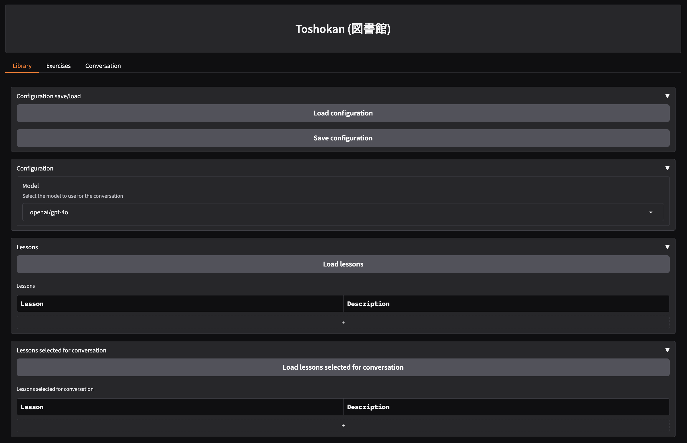

# Toshokan (図書館)

> Practice Japanese with context-aware lessons and guided conversations, powered by LLMs.

[](https://www.python.org/)
[](#)
[](https://hub.docker.com/)
[](https://www.langchain.com/)

The goal of the Toshokan project is to aid English-speaking students in learning Japanese language. In my experience on the path to learn Japanese I realised that there are many obstacles that I haven't come across learning e.g., English or Portuguese. For example:

- Formality levels - Japanese language has Confucianist sense of hierarchy built-in. The conjugation changes depending on age or position in hierarchy (in other languages I know it's just phrases that change or 2nd vs. 3rd person)
- Exposure to language - when looking for ways to gain exposure to language one of first obvious options to explore are Japanese movies, books, manga & anime. Unfortunately, in many of them the language used is not an equivalent of everyday Japanese in real life. Many of these are heavily stylised and rarely match everyday speech
- Kanji logographic register - it's very demanding, you need a way to gradually expose yourself to ever growing number of kanji characters but, especially in the beginning, consulting a kanji dictionary every other word quickly becomes exhausting

In Toshokan I attempted to harness capabilities of contemporary LLMs to remove these barriers. I'm doing so by:

- Controlling the list of known kanji and kanji that you want to schedule to memorise
- Selecting formality level for practicing different language registers. Using LLMs capability to properly select language register for formal / semi-formal / informal situations
- Breaking down the learning process into individual lesson units with limited scope that you can exercise ad infinitum or until you are satisfied
- Including a quick lookup chat for words and auxiliary chat for general questions in context of Japanese
- Listing and annotating all unknown kanji (kanji outside of the known kanji register) during practice conversation

## Install & run

### Prerequisites

As prerequisites, you'll need to set up some env variables. 

Basic configuration includes setting the host and port variables:

```sh
export APP_HOST=0.0.0.0
export APP_PORT=8080
```

Or you can simply use the provided sample file:

```sh
cp env.sample.cfg .env
```

#### Model keys

Depending on the model broker that you use, you'll need to set API keys, like:
```sh
OPENROUTER_API_KEY=<key>  # If you use openrouter/* models
OPENAI_API_KEY=<key>  # If you use openai/* models
```
etc.

#### Local certificate path 

Optionally, you can use certificates. If you do, put your `server.key` and `server.crt` into a dir and pass the `LOCAL_CERT_PATH` env

#### AWS Cognito integration

Optionally, you can integrate the app with AWS cognito for multitenancy. You need to set the following env vars:

```sh
COGNITO_INTEGRATE=true
COGNITO_DOMAIN=<domain>
COGNITO_DOMAIN_CLIENT_ID=<client id>
COGNITO_DOMAIN_REDIRECT_URI_LOGIN=<redirect client login>
COGNITO_DOMAIN_REDIRECT_URI_LOGOUT=<redirect client logout>
COGNITO_DOMAIN_USER_POOL_ID=<user pool id>
COGNITO_DOMAIN_REGION=<cognito region>
```

#### Optional LangSmith tracing

You can enable Langsmith tracing for registering runs. To do so set LS-related env variables:

```sh
LANGCHAIN_TRACING_V2=true
LANGCHAIN_ENDPOINT=https://api.smith.langchain.com
LANGCHAIN_API_KEY=<your LS API key>
```

### Building and running directly from code

Clone the repo:

```sh
$ git clone https://github.com/ishish222/toshokan
$ cd toshokan
```

Set the env variables

```sh
$ export OPENROUTER_API_KEY=...
```

Install dependencies and run

```sh
$ poetry install
$ poetry run python -m toshokan.frontend.app
```

Navigate to: http://<APP_HOST>:<APP_PORT>

### Building and running from the Dockerfile

Build the image with:

```sh
$ docker build -f dockerfiles/Dockerfile.dashboard.single -t toshokan-dashboard .
```

Run:

```sh
$ docker run -p 80:8080 --env-file .env toshokan-dashboard 
```

## Usage

### Configuration save / load

Here is the initial screen of the application:



In the initial screen you can save and load materials that will be used throughout the exercises and guided conversations.

The main components of the configuration include:

1. Lessons

Use the lessons interface to load description of the learning units such as specific grammatical forms.


An initial set of lessons is included in `artifacts/lessons.csv`. The content is limited to my progress, unfortunately, but feel free to expand it.

2. Exercise types

There are several exercise types that you can combine with lessons to launch an exercise, for example:
- Translation from English to Japanese
- Translation from Japanese to English
- Ordering sentence pieces
- Filling in the gaps


An initial set of exercise types is included in `artifacts/exercise_types.csv`. Feel free to expand it!

3. Known / scheduled kanji

The rules for the exercises and conversations are: if you don't know the kanji, the system should add hiragana in parentheses.

If you register a kanji as scheduled kanji (meaning, scheduled memorisation), the system should try and include this kanji in sentences during exercises and conversation.


A sample set of known/scheduled kanji is included in `artifacts/known_kanji.csv` and `artifacts/scheduled_kanji.csv`. Feel free to expand it!

4. Model selection and general configuration

This section allows you to pick a model from the set of available models. Don't forget to add relevant keys in your .env!


You can save/load all the above configuration settings in bulk with Load configuration / Save configuration functions.

### Exercises

Once you've loaded lessons and exercise types you can head to the Exercises tab and start doing the exercises. Each exercise is a combination of lesson and exercise type.


Once you pick the combination, click the Initiate exercise button to start doing exercises.


### Conversations

After you've done some exercises you might want to test your skills in a guided conversation. First, select lessons that you want to "include" in the conversation.


Then, select the formality mode and describe a situation (or let the LLM create a random situation for you).


Once you're set, click Initiate conversation button to launch the conversation.

The conversation will take place in the main window. 


If you want to quickly lookup translation of a word from English to Japanese or the other way around, use the Japanese Word tab.


When system detects in conversation kanji characters that are not in your Known Kanji register, it will include the hiragana and description in the kanji notes. Also, any additional notes regarding conversation (such as notes regarding style, appropriateness, naturalness of your sentences) will be included in notes as well.


## Feedback

All feedback is welcome! Please feel free to reach out to me at: ts@ishish.io
